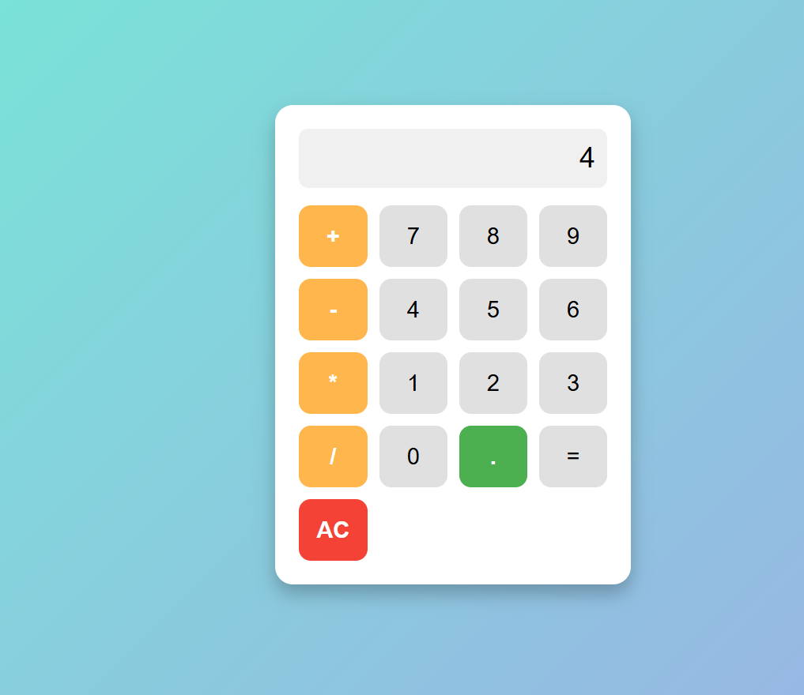

# 🧮 Calculator

A simple calculator web app built with **HTML, CSS, and JavaScript**.  
It supports basic arithmetic operations like addition, subtraction, multiplication, and division.

---

## 🚀 Features
- Responsive design  
- Supports `+`, `-`, `*`, `/` operators  
- Clear display (AC button)  
- Decimal point support  
- Real-time input display  

---

## 🖼️ Screenshot

